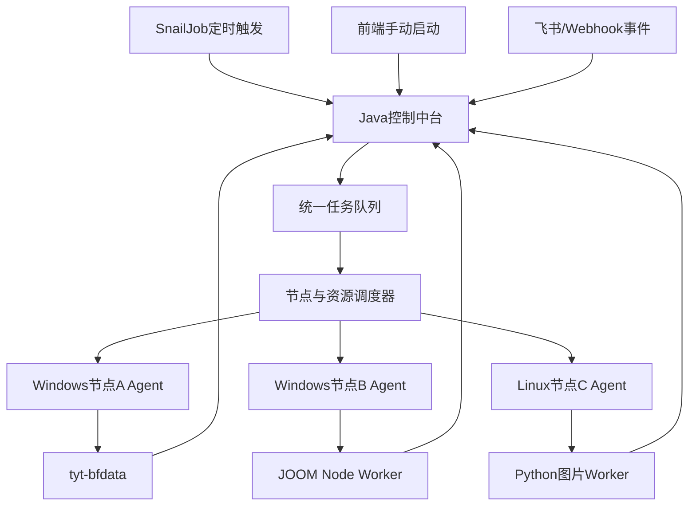

建议拆成三份文档：

```
doc/RPA多节点调度/
├─ 01-总体架构与实施方案.md
├─ 02-主系统控制中台实施方案.md
└─ 03-执行节点子系统实施方案.md
```

以下是完整 Markdown 内容。

------

# 01-总体架构与实施方案.md

## 1. 建设目标

建立统一的多节点 RPA 自动化平台，支持：

- Linux 服务器集中管理项目、任务、节点、调度和日志。
- 多台 Windows/Linux 电脑执行不同类型任务。
- Node.js、Python、影刀、Playwright 等执行器统一接入。
- 定时任务、手动任务、事件任务使用同一调度链路。
- 支持固定节点、节点池和优先节点故障转移。
- 防止同一电脑上的多个自动化项目争抢浏览器等资源。
- 节点断线、进程崩溃后自动回收租约和恢复任务。

## 2. 系统边界

系统分为三个部分：

```
主系统控制中台
├─ Java后端
├─ Vue前端
├─ MySQL
├─ Redis
└─ SnailJob

执行节点子系统
├─ 通用Agent
├─ 本地资源锁
├─ 进程管理器
└─ Node/Python运行环境

业务执行器
├─ tyt-bfdata
├─ tyt-joom-worker
├─ topview-python-worker
└─ 后续其他自动化项目
```

职责划分：

| 模块       | 职责                                   |
| ---------- | -------------------------------------- |
| 控制中台   | 决定执行什么、何时执行、交给哪个节点   |
| 节点Agent  | 管理电脑资源、领取任务、启动和终止进程 |
| 业务Worker | 完成采集、上品、图片处理等具体业务     |
| SnailJob   | 按时间创建任务，不直接调用某台电脑     |
| Redis      | Nonce防重、短锁、在线状态辅助缓存      |
| MySQL      | 项目、任务、租约和日志的唯一事实来源   |

## 3. 总体架构

````

````

## 4. 统一调度流程

```
触发器创建任务
    ↓
任务进入 QUEUED
    ↓
匹配节点能力和资源
    ↓
没有资源：WAITING_RESOURCE
    ↓
Agent获取节点租约
    ↓
Agent认领任务
    ↓
启动Node/Python子进程
    ↓
持续上报心跳和日志
    ↓
成功/失败/超时
    ↓
释放任务租约和节点资源
```

## 5. 节点分配模式

### 5.1 固定节点

适用于Cookie、浏览器窗口或影刀环境只存在于特定电脑的项目。

```
assignmentMode = FIXED
fixedNodeCode = WIN-126
```

节点离线时任务等待，不自动迁移。

### 5.2 节点池

适用于图片处理、Excel解析、API同步等无状态任务。

```
assignmentMode = POOL
resourceGroup = image-processing
```

调度器从节点池中选择负载最低的节点。

### 5.3 优先节点

适用于多台电脑部署相同运行环境的项目。

```
assignmentMode = PREFERRED
preferredNodeCode = WIN-127
resourceGroup = joom-workers
failoverEnabled = true
```

优先节点不可用时允许切换备用节点。

## 6. 资源模型

每个任务可声明一个或多个资源：

```
{
  "requiredResources": [
    {
      "resourceKey": "win126-browser",
      "slots": 1
    },
    {
      "resourceKey": "joom-account-001",
      "slots": 1
    }
  ]
}
```

推荐资源：

| 资源                 | 用途                         |
| -------------------- | ---------------------------- |
| `browser-automation` | 比特浏览器、Playwright、影刀 |
| `joom-account-*`     | 防止同一账号并发上品         |
| `feishu-api`         | 控制飞书API并发              |
| `image-processing`   | Python图片任务               |
| `gpu`                | AI/GPU任务                   |
| `network-upload`     | 图片上传带宽                 |

第一阶段所有浏览器节点使用 `capacity=1`。

## 7. 状态机

任务状态：

```
CREATED
→ QUEUED
→ WAITING_RESOURCE
→ CLAIMED
→ RUNNING
→ SUCCESS
```

异常状态：

```
RUNNING → RETRY_WAIT → QUEUED
RUNNING → FAILED
RUNNING → BLOCKED
RUNNING → TIMEOUT
RUNNING → CANCELLED
```

节点状态：

```
OFFLINE → ONLINE → RESERVED → BUSY → ONLINE
BUSY → DRAINING → ONLINE
BUSY → UNHEALTHY
```

租约状态：

```
ACTIVE → RELEASED
ACTIVE → EXPIRED
ACTIVE → CANCELLED
```

## 8. 技术原则

- SnailJob只负责生成任务。
- Agent只管理机器和进程。
- Worker只处理业务动作。
- Node/Python不进行主业务配置计算。
- 所有结果通过标准API回传。
- 使用租约和心跳处理断电、断网和进程崩溃。
- 第一阶段使用MySQL任务队列，不引入MQ。
- 任务量明显增长后再引入RabbitMQ或Kafka。

## 9. 实施阶段

1. 完善主系统节点、项目和任务模型。
2. 实现节点能力匹配和资源租约。
3. 开发统一执行节点Agent。
4. 接入 `tyt-bfdata`。
5. 接入 JOOM Worker。
6. 接入第一个Python Worker。
7. 增加节点池、槽位和故障转移。
8. 增加统一监控、告警和版本管理。

------

# 02-主系统控制中台实施方案.md

## 1. 模块位置

在现有 Maven 项目使用：

```
tyt-rpa-cloud/ruoyi-modules/ruoyi-rpa
└─ org.dromara.rpa
   ├─ project
   ├─ task
   ├─ node
   ├─ resource
   ├─ worker
   ├─ schedule
   ├─ security
   └─ monitor
```

前端目录：

```
tyt-rpa-web/src/views/rpa-console/
├─ projects
├─ tasks
├─ nodes
├─ workers
├─ schedules
└─ logs
```

## 2. 核心数据表

### 2.1 自动化项目

```
rpa_project
├─ id
├─ tenant_id
├─ project_key
├─ project_name
├─ runtime_type
├─ assignment_mode
├─ fixed_node_code
├─ preferred_node_code
├─ resource_group
├─ required_capabilities_json
├─ priority
├─ timeout_seconds
├─ max_retry_count
├─ enabled
├─ version
└─ 审计字段
```

### 2.2 执行节点

```
rpa_execution_node
├─ id
├─ tenant_id
├─ node_code
├─ node_name
├─ ip_address
├─ os_type
├─ status
├─ capabilities_json
├─ resource_group
├─ max_slots
├─ used_slots
├─ agent_version
├─ heartbeat_at
├─ version
└─ 审计字段
```

### 2.3 执行任务

```
rpa_execution_task
├─ id
├─ tenant_id
├─ request_id
├─ project_key
├─ trigger_type
├─ trigger_source
├─ priority
├─ status
├─ execute_data_json
├─ required_resources_json
├─ assigned_node_id
├─ claim_token
├─ lease_expires_at
├─ retry_count
├─ max_retry_count
├─ next_retry_at
├─ queued_at
├─ claimed_at
├─ started_at
├─ heartbeat_at
├─ finished_at
├─ error_code
├─ error_message
├─ version
└─ 审计字段
```

### 2.4 资源与租约

```
rpa_resource
├─ resource_key
├─ resource_group
├─ node_id
├─ capacity
├─ used_capacity
└─ enabled
rpa_resource_lease
├─ node_id
├─ task_id
├─ project_key
├─ lease_token
├─ resource_keys_json
├─ status
├─ acquired_at
├─ heartbeat_at
├─ expires_at
└─ released_at
```

### 2.5 执行日志

```
rpa_execution_log
├─ task_id
├─ node_id
├─ worker_id
├─ level
├─ step
├─ message
├─ details_json
└─ occurred_at
```

## 3. 调度器实现

新增：

```
TaskCreationService
NodeMatchingService
ResourceLeaseService
TaskClaimService
TaskCallbackService
LeaseRecoveryService
```

节点匹配流程：

```
List<Node> candidates = nodeRepository.findOnlineNodes();

candidates = candidates.stream()
    .filter(node -> node.supports(task.getRequiredCapabilities()))
    .filter(node -> node.hasAvailableSlots(task.getRequiredSlots()))
    .filter(node -> resourceService.canAcquire(node, task))
    .toList();

Node selected = nodeSelector.select(task, candidates);
```

选择顺序：

```
固定节点
→ 优先节点
→ 空闲槽位最多
→ CPU/内存负载最低
→ 最久未分配任务
```

## 4. 原子认领

使用事务和条件更新：

```
UPDATE rpa_execution_task
SET status = 'CLAIMED',
    assigned_node_id = ?,
    claim_token = ?,
    lease_expires_at = ?,
    claimed_at = NOW(),
    version = version + 1
WHERE id = ?
  AND status IN ('QUEUED', 'WAITING_RESOURCE')
  AND version = ?
  AND del_flag = '0';
```

只有影响行数为1，任务才认领成功。

多实例部署时可以使用：

```
SELECT id
FROM rpa_execution_task
WHERE status = 'QUEUED'
  AND next_retry_at <= NOW()
ORDER BY priority DESC, queued_at ASC
LIMIT 1
FOR UPDATE SKIP LOCKED;
```

## 5. Worker API

```
POST /api/rpa/workers/register
POST /api/rpa/workers/heartbeat

POST /api/rpa/tasks/claim
POST /api/rpa/tasks/{taskId}/started
PUT  /api/rpa/tasks/{taskId}/heartbeat
POST /api/rpa/tasks/{taskId}/logs
POST /api/rpa/tasks/{taskId}/complete
POST /api/rpa/tasks/{taskId}/fail
POST /api/rpa/tasks/{taskId}/release
```

所有回调必须携带：

```
{
  "claimToken": "uuid",
  "version": 4
}
```

旧Worker提交过期结果时返回：

```
{
  "code": 40901,
  "msg": "STALE_CLAIM"
}
```

## 6. SnailJob职责

SnailJob执行器只创建任务：

```
@JobExecutor(name = "rpaScheduledTaskCreator")
public class RpaScheduledTaskCreator {

    public ExecuteResult jobExecute(JobArgs args) {
        taskCreationService.createScheduledTask(args.getJobParams());
        return ExecuteResult.success();
    }
}
```

禁止：

```
SnailJob → 直接访问电脑IP → 启动Node脚本
```

必须使用：

```
SnailJob → 创建任务 → 中央调度 → Agent执行
```

定时任务：

| 执行器                    | 周期     | 作用             |
| ------------------------- | -------- | ---------------- |
| `rpaScheduledTaskCreator` | 业务Cron | 创建业务任务     |
| `rpaLeaseRecovery`        | 每分钟   | 回收过期租约     |
| `rpaNodeHealthCheck`      | 每分钟   | 标记离线节点     |
| `rpaRetryDispatcher`      | 每分钟   | 重新入队重试任务 |

## 7. 安全设计

Agent使用机器身份，不使用运营用户JWT：

```
X-Worker-Id
X-Timestamp
X-Nonce
X-Signature
```

签名内容：

```
HMAC-SHA256(
  workerSecret,
  method + path + timestamp + nonce + sha256(body)
)
```

要求：

- 时间偏差不超过5分钟。
- Nonce在Redis保存10分钟。
- Worker Secret绑定租户和节点。
- Secret不得返回前端。
- Cookie、Token、密码不得写入任务日志。
- 节点只能认领自身能力范围内的任务。

## 8. 前端页面

菜单建议：

```
自动化平台
├─ 自动化项目
├─ 执行任务
├─ 执行节点
├─ Worker管理
├─ 调度规则
├─ 资源管理
└─ 平台执行日志
```

执行节点页面展示：

- 在线状态
- IP和操作系统
- Agent版本
- 支持能力
- 当前任务
- 使用槽位
- CPU、内存
- 最后心跳
- 当前资源租约

任务页面展示：

- 项目
- 触发方式
- 优先级
- 状态
- 分配节点
- 等待原因
- 重试次数
- 执行时长
- 错误分类

## 9. 超时恢复

默认参数：

```
Agent心跳：30秒
任务心跳：30秒
租约有效期：120秒
回收扫描：60秒
默认重试：3次
退避时间：1分钟、5分钟、15分钟
```

超时处理：

```
节点心跳超时 → 节点OFFLINE
任务心跳超时 → TIMEOUT
租约超时 → EXPIRED
技术错误 → RETRY_WAIT
账号或验证码错误 → BLOCKED
```

## 10. 主系统测试

必须覆盖：

- 两个Agent不能认领同一任务。
- 同一资源不能产生两个有效租约。
- 固定节点离线时任务保持等待。
- 节点池任务可以分配给其他在线节点。
- 高优先级任务优先获得下一个空闲资源。
- 高优先级任务不抢占正在运行的任务。
- Worker断线后租约自动过期。
- 旧Worker回调返回 `STALE_CLAIM`。
- 同一个 `requestId` 不创建重复任务。
- 不同租户不能读取彼此的节点和任务。

------

# 03-执行节点子系统实施方案.md

## 1. 子系统定位

每台执行电脑只安装一个通用 Agent。

Agent不处理具体业务，只负责：

- 注册节点。
- 上报节点状态。
- 领取任务。
- 获取本地资源锁。
- 启动Node/Python进程。
- 发送任务心跳。
- 收集日志。
- 终止超时进程。
- 回传结果。
- 释放资源。

## 2. 推荐技术栈

通用Agent建议使用 Node.js：

```
Node.js 20
TypeScript
Zod
Pino
Axios或原生Fetch
Execa
WinSW/NSSM
Vitest
```

Node.js Agent可以同时启动：

- Node.js脚本
- Python脚本
- BAT/PowerShell
- 影刀命令
- 其他本地可执行程序

## 3. 目录结构

Windows节点：

```
D:\tyt-rpa-node\
├─ agent\
│  ├─ dist\
│  ├─ config\
│  └─ logs\
├─ workers\
│  ├─ tyt-bfdata\
│  ├─ tyt-joom-worker\
│  └─ topview-worker\
├─ runtime\
│  ├─ locks\
│  ├─ tasks\
│  └─ temp\
└─ secrets\
```

Linux节点：

```
/opt/tyt-rpa-node/
├─ agent/
├─ workers/
├─ runtime/
├─ logs/
└─ secrets/
```

## 4. Agent模块

```
src/
├─ api/
│  ├─ control-plane-client.ts
│  └─ hmac.ts
├─ node/
│  ├─ register.ts
│  ├─ heartbeat.ts
│  └─ metrics.ts
├─ scheduler/
│  ├─ poller.ts
│  └─ task-runner.ts
├─ process/
│  ├─ node-runner.ts
│  ├─ python-runner.ts
│  └─ command-runner.ts
├─ resource/
│  ├─ local-lock.ts
│  └─ slot-manager.ts
├─ logs/
│  └─ log-uploader.ts
└─ index.ts
```

## 5. Agent配置

```
CONTROL_PLANE_URL=https://rpa.example.com
WORKER_ID=agent-win126-01
WORKER_SECRET=replace-me
NODE_CODE=WIN-126
NODE_NAME=服装采集电脑

POLL_INTERVAL_MS=5000
HEARTBEAT_INTERVAL_MS=30000
LEASE_TTL_SECONDS=120
MAX_CONCURRENT_TASKS=1

RUNTIME_DIR=D:\tyt-rpa-node\runtime
WORKERS_DIR=D:\tyt-rpa-node\workers
```

节点能力配置：

```
{
  "osType": "WINDOWS",
  "capabilities": [
    "NODEJS",
    "PYTHON",
    "BITBROWSER",
    "YINGDAO",
    "TYT_BFDATA"
  ],
  "resourceGroups": [
    "browser-automation"
  ]
}
```

## 6. Worker清单

Agent本地维护允许启动的项目白名单：

```
{
  "tyt-bfdata": {
    "runtime": "NODE",
    "workingDirectory": "D:\\tyt-rpa-node\\workers\\tyt-bfdata",
    "command": "node",
    "entry": "run.js",
    "timeoutSeconds": 3600
  },
  "joom-listing": {
    "runtime": "NODE",
    "workingDirectory": "D:\\tyt-rpa-node\\workers\\tyt-joom-worker",
    "command": "node",
    "entry": "dist/index.js",
    "timeoutSeconds": 600
  },
  "topview-image": {
    "runtime": "PYTHON",
    "workingDirectory": "D:\\tyt-rpa-node\\workers\\topview",
    "command": ".venv\\Scripts\\python.exe",
    "entry": "main.py",
    "timeoutSeconds": 900
  }
}
```

Java下发的命令不能覆盖本地白名单中的可执行文件路径，防止远程命令注入。

## 7. 任务执行协议

Agent认领任务：

```
{
  "nodeCode": "WIN-126",
  "availableSlots": 1,
  "capabilities": ["NODEJS", "BITBROWSER"]
}
```

Java返回：

```
{
  "taskId": 8872,
  "projectKey": "tyt-bfdata",
  "claimToken": "uuid",
  "version": 1,
  "timeoutSeconds": 3600,
  "executeData": {
    "projectId": 1001
  }
}
```

Agent启动命令：

```
node run.js --task-file D:\tyt-rpa-node\runtime\tasks\8872.json
```

不建议把完整业务JSON直接放进命令行，避免长度限制和敏感信息泄漏。

## 8. 标准Worker输出

业务Worker通过标准输出发送结构化事件：

```
{"type":"LOG","level":"INFO","step":"LOGIN","message":"登录成功"}
{"type":"PROGRESS","current":10,"total":59}
{"type":"RESULT","status":"SUCCESS","data":{"recordCount":59}}
```

Agent解析标准输出并批量上传。

Worker退出码：

| 退出码 | 含义                 |
| ------ | -------------------- |
| `0`    | 成功                 |
| `10`   | 业务失败，不重试     |
| `20`   | 技术错误，可重试     |
| `30`   | 账号阻塞             |
| `40`   | 用户取消             |
| `50`   | 页面或自动化规则失效 |

## 9. 本地资源锁

中心租约之外必须保留本地锁：

```
D:\tyt-rpa-node\runtime\locks\browser-automation.lock
```

锁内容：

```
{
  "taskId": 8872,
  "projectKey": "joom-listing",
  "pid": 12340,
  "claimToken": "uuid",
  "acquiredAt": "2026-07-13 15:00:00",
  "heartbeatAt": "2026-07-13 15:00:30"
}
```

本地锁使用原子创建，不能先判断存在再创建。

中心租约防止多后端实例重复调度；本地锁防止Java不可用、旧计划任务或人工启动导致冲突。

## 10. 心跳与进程管理

执行期间并行运行：

```
节点心跳
任务心跳
本地锁心跳
子进程状态监控
日志上传
```

连续三次任务心跳失败：

1. 暂停继续执行高风险步骤。
2. 尝试恢复控制中台连接。
3. 无法恢复时终止子进程。
4. 保留本地日志。
5. 释放或标记本地锁过期。

不得在失去租约后继续提交第三方业务操作。

## 11. Node和Python项目接入规范

每个业务Worker只实现统一入口：

Node.js：

```
export async function execute(task: WorkerTask): Promise<WorkerResult> {
  // 具体业务
  return {
    status: 'SUCCESS',
    data: {}
  };
}
```

Python：

```
def execute(task: dict) -> dict:
    return {
        "status": "SUCCESS",
        "data": {}
    }
```

业务Worker不得：

- 自己轮询控制中台。
- 自己抢占节点。
- 自己修改任务状态。
- 自己实现另一套HMAC。
- 自己创建全局定时器。
- 绕过Agent启动其他项目。

## 12. 服务安装

Windows建议使用WinSW或NSSM将Agent安装为服务：

```
服务名称：TytRpaNodeAgent
启动方式：自动
失败恢复：5秒后重启
运行账号：专用低权限账号
```

Linux建议使用systemd：

```
[Unit]
Description=TYT RPA Node Agent
After=network-online.target

[Service]
WorkingDirectory=/opt/tyt-rpa-node/agent
ExecStart=/usr/bin/node dist/index.js
Restart=always
RestartSec=5
EnvironmentFile=/opt/tyt-rpa-node/secrets/agent.env

[Install]
WantedBy=multi-user.target
```

## 13. 子系统测试

必须覆盖：

- Agent注册和心跳。
- HMAC签名和Nonce防重。
- 本地锁原子抢占。
- 同一资源不能启动两个进程。
- Node Worker启动和退出码解析。
- Python Worker启动和退出码解析。
- 子进程超时后被终止。
- Agent重启后清理过期锁。
- 网络中断后停止高风险操作。
- 日志上传失败时本地缓冲。
- 旧任务恢复后不能覆盖新任务结果。
- 未在白名单中的命令不能执行。

## 14. 第一阶段节点规划

```
WIN-126
├─ Agent
├─ tyt-bfdata
├─ 影刀
└─ browser-automation容量：1

WIN-127
├─ Agent
├─ tyt-joom-worker
├─ 比特浏览器
└─ browser-automation容量：1

LINUX-WORKER-01
├─ Agent
├─ Python图片Worker
├─ Excel处理Worker
└─ image-processing容量：4
```

后续增加电脑时，只需要：

1. 安装Agent。
2. 配置节点身份和密钥。
3. 注册能力及资源组。
4. 部署对应Worker。
5. 在主系统将项目绑定到固定节点或节点池。

不需要为每台电脑单独开发后端接口或SnailJob任务。